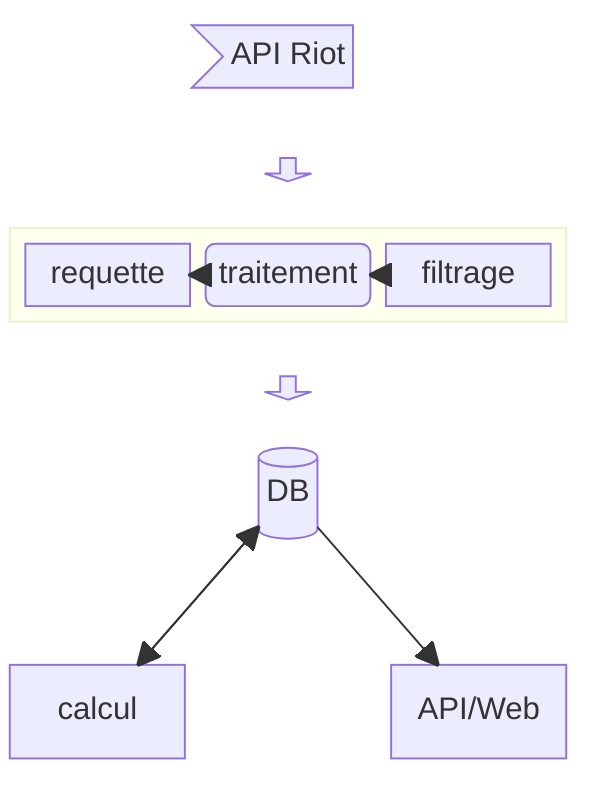

# ASE_Katia_Alicia_Alexandre_Tom

## Pipeline du projet

```mermaid
block-beta
    columns 3
    doc>"API Riot"]:3
    space down1<[" "]>(down) space

  block:e:3
          l["requette"]
          m("traitement")
          r["filtrage"]
  end
    space down2<[" "]>(down) space
    db[("DB")]:3
    space:3
    calcul space API/Web
    db --> calcul
    calcul --> db
    db --> API/Web
    m --> l 
    r --> m
```

